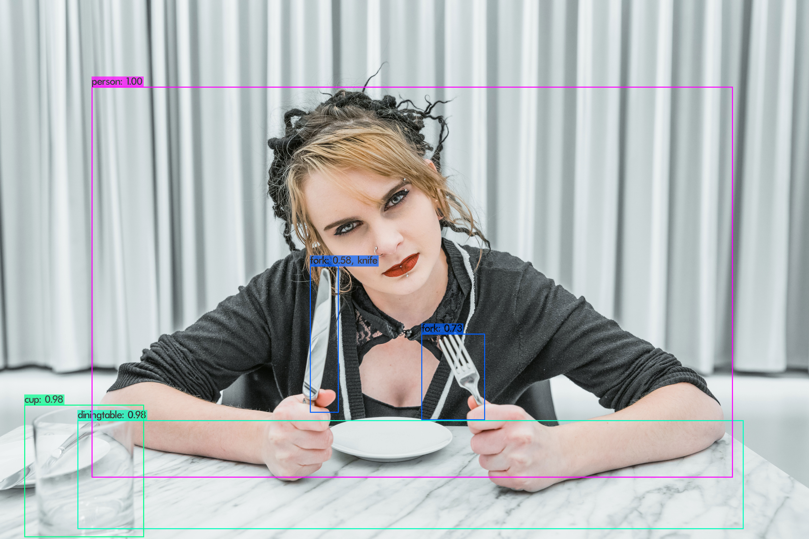
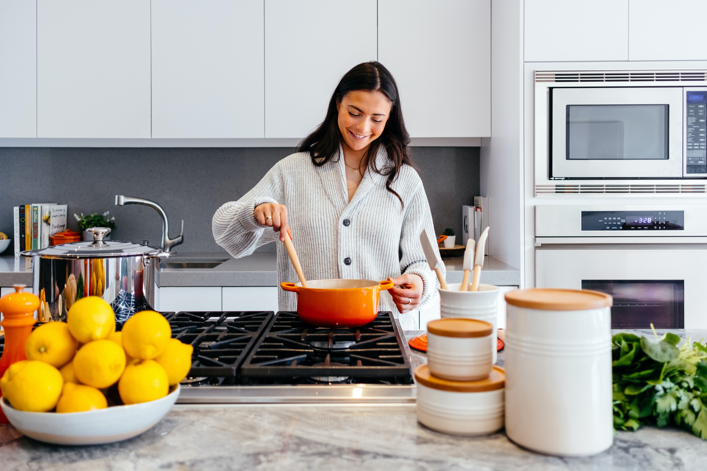

# Image Description
 &nbsp; This project was started with the purpose of improving web accessibility for the visually impaired. It has been proposed to replace 'screen readers', that non-text areas cannot be recognized unless alternative text is provided. 
 &nbsp; Among several areas except text, I want to convey an image as a complete sentence. This program receives an image as an input, extracts the name, color, and location of the object in the image, and completes it into a single sentence.

## YOLO V3
I used **Yolo v3 for object recognition and bounding box creation.** I modified the given code to extract the desired information.
1) The object name and confidence score are saved as a text file.
2) Previous program give Height, length, upper left point and lower right point information of the bounding box. After modification, the **four points of the bounding box** are extracted by calculating previous information. Save the extracted coordinate information as a text file.

## Usage
If you want to use this program, 
1. Download all files. 
2. Input File Address. 
    1) Yolo v3
	    I used and modified 'darknet_no_gpu.sln'. So input the address to save object name, confidence score, and bounding box information into function 'draw_detections_v3' of 'image.c'.
    2) main.cpp
        'main.cpp' contains all files except Yolo v3. So input the address to read original image, bounding box information, save object images, object color information, location information, final image description sentence...
 3. Input Image File.
      Add the image to 'Yolo V3'-'build'-'darknet'-x64'-'data'. 
 4. Run
       1) Yolo V3
            After run this program, You will get text file (include object name, confidence score, bounding box information).
       2) main.cpp
           After running the main file using the above file, You will get Completed iamge description information.

## Result

I will show you some of the results produced by running this program.

**Case 1**
 
**[ original image ]**
 

 
**[ After Yolo V3, An image with a bounding box covered ] **
 

|   Object  |  Confidence score  |  Bounding Box  |
|-----------|--------------------|----------------|
|Cup|98%|200 3343 1190 4438|
|Dining Table|98%|640 3471 6140 4371|
|Person|100%|757 717 6050 3946|
|Fork|58%|2559 2195 2797 3410|
|Fork|73%|3479 2757 4005 3472|
**['Yolo_result.txt' ] **

|   Object  |  Color |  Location  |
|-----------|--------------------|----------------|
|Cup|White|left bottom|
|Dining Table|White|Right bottom|
|Person|White|Center|
|Fork|White|Left bottom|
|Fork|White|Right bottom|
**[Image information] **

There are a white cup in the left bottom and white dining table in the right bottom and white person in the center and white fork in the left bottom and white fork in the right bottom in the image. 
**[ Image Description Sentence _ English]**

이미지의 왼쪽 하단에는 흰색 컵, 오른쪽 하단에는 흰색 식탁, 중앙에는 흰색 사람, 왼쪽 하단에는 흰색 포크, 오른쪽 하단에는 흰색 포크가 있습니다. 
**[ Image Description Sentence _ Korean]**
 

**Case 2**

**[ original image ] **
 

**[ After Yolo V3, An image with a bounding box covered ] **
 

|   Object  |  Confidence score  |  Bounding Box  |
|-----------|--------------------|----------------|
|Orange|79%| 23 3047 537 3484|
|Orange|92%| 73 2447 1585 3541|
|Orange|48%|567 2510 986 2904|
|Oven|93%|1421 2547 3546 3342|
|Person|100%|1878 520 3739 2693|
|Spoon|83%|2304 1794 2612 2435|
|Bowl|57%|2394 2362 3291 2753|
|Cup|82%|3719 2395 4286 2959|
|MicroWave|99%|4503 591 5925 1590|
|Oven|63%|4505 1656 5970 2852|
 
**['Yolo_result.txt' ]**

|   Object  |  Color |  Location  |
|-----------|--------------------|----------------|
|Orange|Yellow|left bottom|
|Orange|White|left bottom|
|Orange|Yellow|left bottom|
|Oven|White|left bottom|
|Person|White|center|
|Spoon|White|center|
|Bowl|White|center|
|Cup|Yellow|right bottom|
|MicroWave|White|right top|
|Oven|White|right bottom|
 
**[Image information]**

There are a yellow orange in the left bottom and a white orange in the left bottom and a yellow orange in the left bottom and a white oven in the left bottom and a white person in the center and a white spoon in the center and a white bowl in the center and yellow cup in the right bottom and a white microwave in the right top and a white oven in the right bottom in the image. 
**[ Image Description Sentence]**

왼쪽 하단에 노란색 주황색, 왼쪽 하단에 흰색 주황색, 왼쪽 하단에 노란색 주황색, 왼쪽 하단에 흰색 오븐, 중앙에 흰색 사람, 중앙에 흰색 숟가락과 흰색이 있습니다. 이미지의 중앙에는 그릇, 오른쪽 하단에는 노란색 컵, 오른쪽 상단에는 흰색 전자 레인지, 오른쪽 하단에는 흰색 오븐이 있습니다. 
**[ Image Description Sentence _ Korean]**
 
